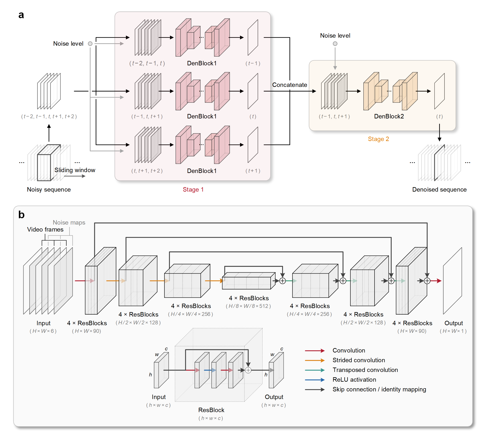
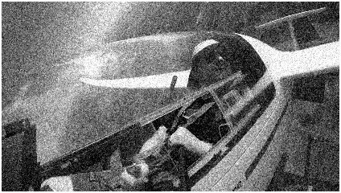
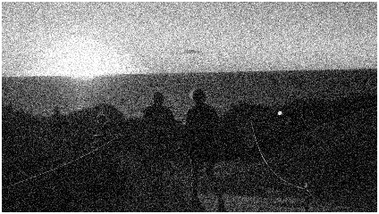
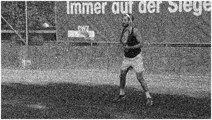
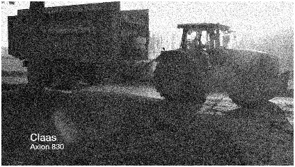

<h1>ViDNet: A Denoising Network for Video Inverse Problems</h1>

**[Yunhui Gao](https://github.com/Yunhui-Gao)** (gyh21@mails.tsinghua.edu.cn) and **[Liangcai Cao](https://scholar.google.com/citations?user=FYYb_-wAAAAJ&hl=en)** (clc@tsinghua.edu.cn)

:school: ***[HoloLab](http://www.holoddd.com/)**, Tsinghua University*

:scroll: [**Publication Page**](xxxxxx) **|** :key: [**Pretrained Models**](#model-zoo) **|**  :dart: [**Selective Results**](#results)

**ViDNet** is a video denoising network that has been specifically designed for plug-and-play (PnP) video restoration tasks. Key features of ViDNet include
- :rocket: **Non-blind denoising capability**, which enables the handling of varying degrees of additive white Gaussian noise (AWGN).
- :rocket:  **Bias-free modules**, which allow for enhanced generalizability to unseen noise levels and stable convergence for PnP iterations.
- :rocket: **Deeper architecture**, which captures long-term spatiotemporal features and offers improved performance in preserving textures and handling rapid motions.

## Requirements

- Python 3.9, PyTorch >= 2.3.1
- Platforms: Windows 10 / 11
- Requirements: see [`requirements.txt`](https://github.com/THUHoloLab/ViDNet/blob/master/requirement.txt)

## Dataset

The released pretrained models have been trained on a dataset consisting of 70,405 five-frame *grayscale* video clips of natural dynamic scenes, which are extracted from the [DAVIS](https://davischallenge.org/) and [Vimeo-90K](http://toflow.csail.mit.edu/) database. Click [here](https://github.com/THUHoloLab/ViDNet/blob/master/dataset/README.md) for a detailed instruction on dataset preparation.

## Model Zoo

We provide the pretrained ViDNet model and benchmarking models, including two [FastDVDnet](https://github.com/m-tassano/fastdvdnet) models with and without batch normalization (BN) layers.

The released pretrained models have been trained on a dataset consisting of 70,405 five-frame *grayscale* video clips of natural dynamic scenes, which are extracted from the [DAVIS](https://davischallenge.org/) and [Vimeo-90K](http://toflow.csail.mit.edu/) database.

| Network             | Pretrained model                                          |
| :----:              | :----:                                                    |
| FastDVDnet (w/ BN)  | to be released |
| FastDVDnet (w/o BN) | to be released |
| ViDNet              | to be released |

## Results

 &nbsp;

 &nbsp;

The following table summarizes AWGN denoising PSNR (dB) on grayscale DAVIS 2017 test set. All networks are trained for noise levels $\sigma\in[0,50]$.

| Noise level $\sigma$  | FastDVDnet (w/ BN) | FastDVDnet (w/o BN) | ViDNet             |
| :----:                | :----:             | :----:              | :----:             | 
| 0                     | 42.91              | 59.39               | **71.13 (+11.74)** |
| 10                    | 37.25              | 37.41               | **38.27 (+0.86)**  |
| 20                    | 34.14              | 34.27               | **35.25 (+0.98)**  |
| 30                    | 32.41              | 32.52               | **33.52 (+1.00)**  |
| 40                    | 31.21              | 31.32               | **32.31 (+0.99)**  |
| 50                    | 30.31              | 30.40               | **31.39 (+0.99)**  |
| 60                    | 29.57              | 29.67               | **30.65 (+0.98)**  |
| 70                    | 28.90              | 29.06               | **30.04 (+0.98)**  |
| 80                    | 28.20              | 28.53               | **29.51 (+0.98)**  |
| 90                    | 27.47              | 28.07               | **29.04 (+0.97)**  |
| 100                   | 26.71              | 27.67               | **28.63 (+0.96)**  |

